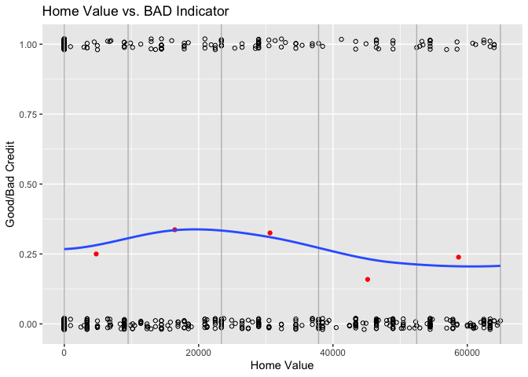
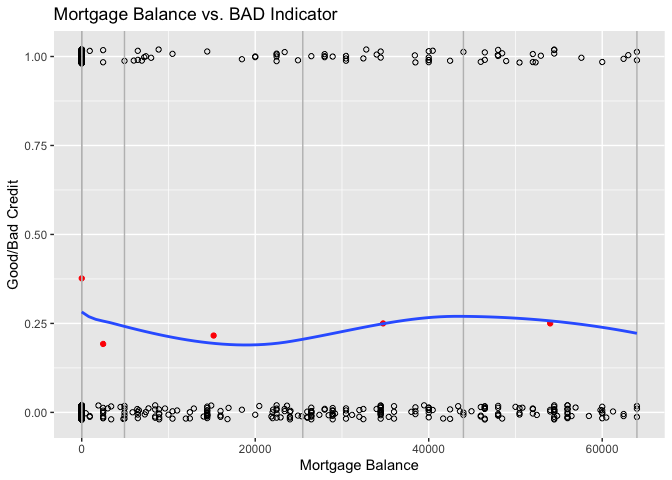
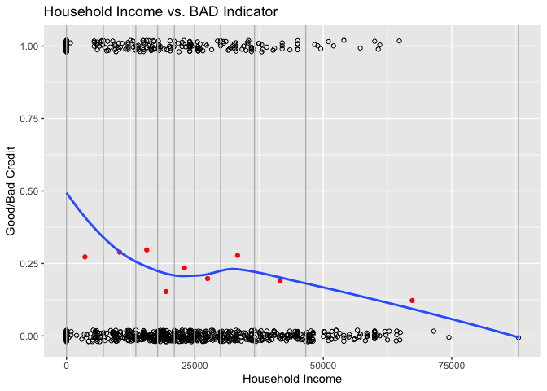
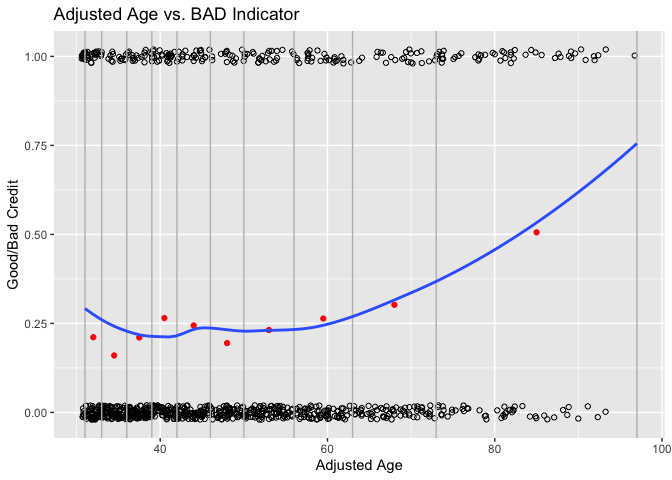
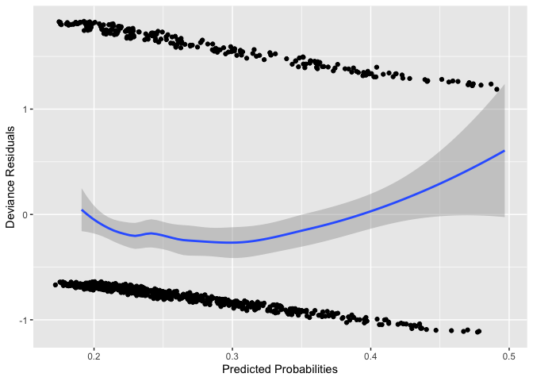
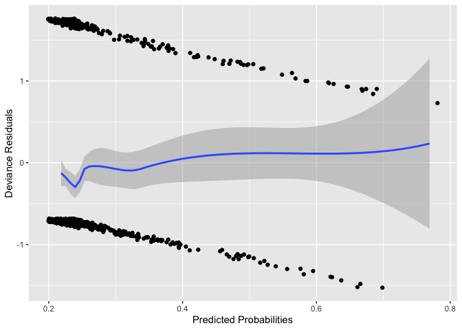
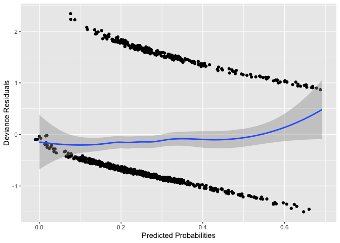
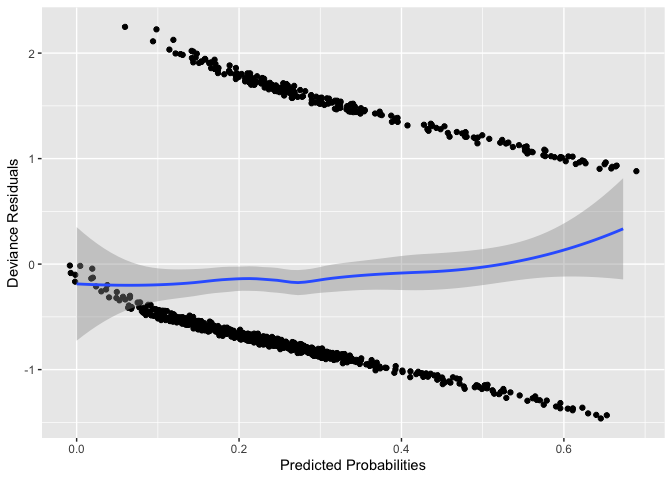
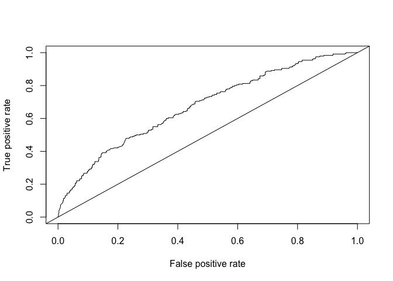
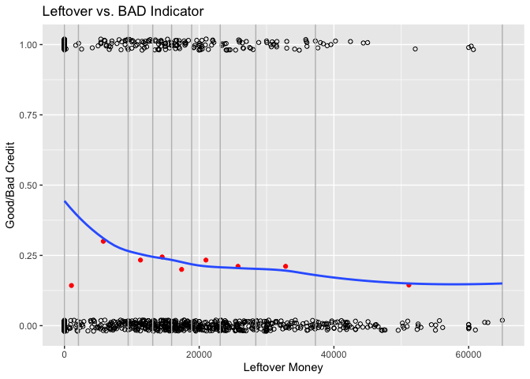

Classifying Loan Applicants
================
Michael Abbate

  - [1. Abstract](#abstract)
  - [2. Introduction](#introduction)
  - [3. Data Characteristics](#data-characteristics)
      - [Target Variable](#target-variable)
      - [Categorical Variables](#categorical-variables)
      - [Continuous Variables](#continuous-variables)
  - [4. Model Selection and
    Interpretation](#model-selection-and-interpretation)
  - [5. Summary and Concluding Remarks](#summary-and-concluding-remarks)
  - [6. References](#references)
  - [7. Appendix](#appendix)

# 1\. Abstract

The ability to predict if someone is a good or bad applicant for a loan
is a valuable skill for banks and financial firms. This skill allows
these companies to invest their money properly for the future. This
study examines a data set of loan applicants that was retrieved from
“Credit Scoring and Its Applications” by Lyn C. Thomas, David B.
Edelman, and Jonathan N. Crook (2002). Logistic regression models were
created to predict probability of default on a loan. From these models,
we concluded that age, household income, credit card expense, and
employment status were significant factors in predicting these
probabilities.

# 2\. Introduction

We will be looking at a file, *credit-data-train.txt*, that consists of
credit applicants information. It consists of variables relevant to the
applicant regarding their spouse, their home, their incomes, expenses,
and number of dependants and children. This report will summarize trends
of being a good/bad credit applicant and some explanatory variables
using logistic regression analysis.

Variables we found to be significant were age, household income, credit
card expense, and employment status. In the original data set, we were
given date of birth, not age. To calculate age, we used the year 2000 as
a reference in relation to date of birth. We used this year because we
retrieved the data set from a book that was published in 2002. Also, we
found that age has a quadratic relationship with the probability of
default. From this, we were able to add and justify the term,
\(\text{age}^2\), to our model. On the other hand, we found that
variables like having a home phone, house value, and total number of
dependants did not show significance in prediciting probability of
defaulting on a loan.

The remainder of the report is structured as follows. The next section
discusses the characteristics of the data we have available and
assumptions about their significance in predicting probability of
defaulting. In the section “Model Selection & Interpretation,” we make a
case for two models that fit the data adequately. The report finishes
with an alternative approach and a summary of our findings and ideas for
further work in this area.

# 3\. Data Characteristics

From the file *credit-data-train.txt*, we have 900 observations that has
15 variables.

The following table shows the variables available and their definitions.

| Item | Variable                     | Definition                                                          |
| :--- | :--------------------------- | :------------------------------------------------------------------ |
| 1    | Date of Birth                | The last two digits of the applicant’s date of birth.               |
| 2    | \# of Children               | The number of children the applicant has.                           |
| 3    | \# of Dependants             | The number of dependants the applicant has.                         |
| 4    | Home Phone                   | Is there a phone in the house?                                      |
| 5    | Spouse’s Income              | The applicant’s spouse’s income (in dollars).                       |
| 6    | Employment Status            | Employment status of the applicant.                                 |
| 7    | Applicant’s Income           | The applicant’s income (in dollars).                                |
| 8    | Residential Status           | The residential status of the applicant.                            |
| 9    | Value of Home                | The value of the applicant’s home.                                  |
| 10   | Mortgage Balance Outstanding | How much money is left on the applicant’s mortgage (in dollars).    |
| 11   | Outgoings on Mortgage/Rent   | Money spent monthly on the applicant’s mortgage (in dollars).       |
| 12   | Outgoings on Loans           | Money spent monthly on the applicant’s Loans (in dollars).          |
| 13   | Outgoings on Hire Purchase   | Money spent monthly on the applicant’s Hire Purchases (in dollars). |
| 14   | Outgoings on Credit Cards    | Money spent monthly on the applicant’s Credit Cards (in dollars).   |
| 15   | Good/Bad Indicator           | Are they a good or bad credit applicant?                            |

Before diving into a model, we must first analyze the data to assure
there are no outliers that will negatively affect our predictions. Also,
going through each variable allows us to make earlier and better
predictions about which would be significant in our model or not.

## Target Variable

First, let’s take a look at the variable we are trying to predict:
`BAD`. This variable is an indicator that tells us if the loan applicant
is “bad” (1) or “good” (0). The following table shows the total number
of applicants, the total number of “bad” applicants, and the average
indicator percentage.

BAD Summary:

| Total.Number.of.Applicants | Number.of.Bad.Applicants | Avg.BAD.Pct |
| :------------------------: | :----------------------: | :---------: |
|            900             |           240            |   0.2667    |

The information above shows us that about 27% of the applicants in the
data set are considered “bad.” A null logistic regression model in the
appendix (A1) shows the same result as the average calculation above.

## Categorical Variables

Resident Status (`RES`):

    ##      Tenant Furnished   Other    Owner With Parents Tenant Unfurnished
    ## BAD           23.0000 22.0000 122.0000      41.0000            32.0000
    ## GOOD          74.0000 24.0000 328.0000     146.0000            88.0000
    ## %BAD           0.2371  0.4783   0.2711       0.2193             0.2667

In this case, because these averages are rather similar to the overall
average, 27%, we will most likely not be including residential status to
distinguish who is a good/bad credit applicant.

Employment Status (`AES`):

    ##      Public Sector Self Employed Military Others Private Sector Retired
    ## BAD         8.0000       28.0000   2.0000      0        90.0000 41.0000
    ## GOOD       15.0000       61.0000  12.0000      3       304.0000 45.0000
    ## %BAD        0.3478        0.3146   0.1429      0         0.2284  0.4767
    ##      Student Unemployed Government Housewife No Response
    ## BAD  23.0000     4.0000    28.0000   13.0000         3.0
    ## GOOD 62.0000     3.0000   136.0000   16.0000         3.0
    ## %BAD  0.2706     0.5714     0.1707    0.4483         0.5

Looking at the table above, the probability of defaulting for each
employment status tends to vary; however, working with 11 categories
within a variable may be too much for a model to be efficient and/or
effective. Thus, we will most likely group similar employment statuses
to condense the variable and use these groupings in our model.

Phone in the house (`PHON`):

    ##      No Phone    Phone
    ## BAD   32.0000 208.0000
    ## GOOD  60.0000 600.0000
    ## %BAD   0.3478   0.2574

Having no phone in the house is above the overall BAD indicator average,
26.67%, in terms of risk. However, because about 90% of applicants do
have a phone in the house, we will most likely not be including this
variable in our model.

Below we will look at the number of children and dependants for each
applicant:

Number of children (`NKID`):

    ##             0       1       2       3       4 5
    ## BAD  165.0000 26.0000 35.0000 13.0000  1.0000 0
    ## GOOD 444.0000 80.0000 98.0000 23.0000 14.0000 1
    ## %BAD   0.2709  0.2453  0.2632  0.3611  0.0667 0

Number of dependants (`DEP`):

    ##             0       1   2
    ## BAD  229.0000  8.0000 3.0
    ## GOOD 639.0000 19.0000 2.0
    ## %BAD   0.2638  0.2963 0.6

The majority of applicants have 0 children and 0 dependants and the
majority of applicants’ probability of defaulting is around the original
average, 0.2667. Therefore, because these variables are similar and the
averages are close to the original average, we will most likely not be
including number of kids or dependants in our model.

## Continuous Variables

This section will look at the continuous variables in our data set.

The following graph shows the distribution of home value, `DHVAL`, and
the `BAD` indicator:

    ## `geom_smooth()` using method = 'loess' and formula 'y ~ x'

<!-- -->

The following graph shows the distribution of mortgage balance, `DMORT`,
and the `BAD` indicator:

    ## `geom_smooth()` using method = 'loess' and formula 'y ~ x'

<!-- -->

A value of ‘0’ for these variables means there were no responses for
home value or mortgage balance. However, looking at all values greater
than 0 for both home values and mortgage balance, we do not see a
significant difference in BAD averages. Thus, we will most likely not be
including home value and mortgage balance in our model.

After looking at the distributions for applicant income and spouse
income, we concluded they have a similar pattern of probability of
default. As a result, we decided to combine these two variables into
household income, `hhinc`.

Household Income distribution:

    ## `geom_smooth()` using method = 'loess' and formula 'y ~ x'

<!-- -->

From the graph above, we concluded there is a significant trend in
probability of default from Household Income. The trend is downwards
meaning as household income increases, the likelihood of being a “bad”
loan applicant decreases.

There are four variables that deal with the applicants’ expenses:
mortgage expense (`DOUTM`), loan expense (`DOUTL`), hire purchase
expense (`DOUTHP`), and credit card expense (`DOUTCC`). The averages
from the four expenses in the data set range from $27.48 to $326.58.
Therefore, these expenses are provided monthly rather than annually,
like the income variables. Using both household income and the expenses,
we created a variable that calculates the amount of money leftover after
paying off all monthly expenses. This variable, `leftover`, is equal to
\(\text{Household Income - 12*Expenses}\). We found this variable to be
insignificant in prediciting probability of default. Its distribution is
shown in appendix (A2).

In this data set, we were given `DOB`, which provides the last two
digits of the year the applicant was born. From this variable, we
calculated age by subtracting the `DOB` from 100. This gives us the
applicants age in reference to the year 2000. The following information
summarizes `age`:

    ##    Min. 1st Qu.  Median    Mean 3rd Qu.    Max. 
    ##    1.00   37.00   45.00   49.58   59.00   97.00

Note that having the age of 1 means that age was unknown for these
candidates. Including these values slightly skews the data because the
age summary above shows that most values are above the age of 30 and
there are only 4 values with age of 1. To assure the data has no
outliers, we will use the average age value for these applicants
instead. The calculation of this average will exclude those who did not
submit an age. We are comfortable doing this because, as mentioned
before, there are only 4 observations in which age was not submitted. If
a larger percentage of applicants did not submit their age, a more
accurate approach would have been used to assure the age variable was
precise and not skewed. This adjusted age variable will be called,
`age.adj`.

    ##    Min. 1st Qu.  Median    Mean 3rd Qu.    Max. 
    ##    31.0    37.0    46.0    49.8    59.0    97.0

The following graph shows the distribution of `age.adj` and the `BAD`
indicator:

    ## `geom_smooth()` using method = 'loess' and formula 'y ~ x'

<!-- -->

The trend from the graph above shows that as age increases, applicants
are more likely to be “bad” credit applicants. Due to this increase, we
will most likely include this variable in our model.

# 4\. Model Selection and Interpretation

The data characteristics section gave us insights on which variables
will most likely be significant in predicting a “bad” or “good” loan
applicant. This section will summarize these variables together in the
attempt to predict `BAD` indicator. After stating the model and giving
its interpretations, we will look at the data driven steps taken to
select the recommended model. These steps include looking at
cross-validation, the Hosmer-Lemeshow statistic, and metrics of the
models.

### The Recommended Model

After going through all of the variables and gaining insights and
assumptions from our data characteristics section, we now have enough
information to narrow our selection down to two models: `m01` and `m02`.
In the end, we ended up selecting Model 1, `m01`, as our recommended
model for numerous reasons that we will touch upon later in this
section.

``` r
m01 = glm(BAD ~ age.adj + I(age.adj^2) + DOUTCC + hhinc + emp_cat, data = credit, family = binomial(link = 'logit'))

m02 = glm(BAD ~ age.adj + I(age.adj^2) + DOUTCC + hhinc, data = credit, family = binomial(link = 'logit'))
```

|                     |  Estimate   | Std. Error | z value  | Pr(\>|z|) |
| :-----------------: | :---------: | :--------: | :------: | :-------: |
|   **(Intercept)**   |  \-0.7294   |   0.9898   | \-0.7369 |  0.4612   |
|     **age.adj**     |   0.01004   |  0.03772   |  0.2661  |  0.7902   |
|  **I(age.adj^2)**   |  5.076e-05  | 0.0003271  |  0.1552  |  0.8767   |
|     **DOUTCC**      | \-0.003203  |  0.001418  | \-2.259  |  0.0239   |
|      **hhinc**      | \-2.639e-05 |  5.76e-06  | \-4.582  | 4.614e-06 |
| **emp\_catGroup 2** |  \-0.4411   |   0.2003   | \-2.202  |  0.02766  |

Model 1

|                  |  Estimate   | Std. Error | z value | Pr(\>|z|) |
| :--------------: | :---------: | :--------: | :-----: | :-------: |
| **(Intercept)**  |   \-1.233   |   0.9589   | \-1.286 |  0.1985   |
|   **age.adj**    |   0.01303   |  0.03764   | 0.3463  |  0.7291   |
| **I(age.adj^2)** |  8.245e-05  | 0.0003269  | 0.2522  |  0.8009   |
|    **DOUTCC**    | \-0.003269  |  0.001432  | \-2.283 |  0.02242  |
|    **hhinc**     | \-2.851e-05 | 5.714e-06  | \-4.99  | 6.029e-07 |

Model 2

The groups within the categorical employment status variable are as
follows:

| Group | Employment Status                                                                |
| :---- | :------------------------------------------------------------------------------- |
| 1     | Public Sector, Self Employed, Retired, Housewife, Unemployed, Other, No Response |
| 2     | Private Sector, Military, Student, Government                                    |

### Interpretation of the Model

Our model includes components of age, credit card expense, income, and
employment status. To better understand our recommended model, let’s set
up an example to test it out. First, we will use all median values for
continuous variables and Group 1 of our categorical employment status
variable. Consider a 46-year old applicant that is retired. He and his
spouse combined make $21,000 per year, and he pays a credit card expense
of $40 per month. Our equation will look like this:

\[
\pi = \frac{\text{e}^{(-0.7294+0.01004(46)+(5.076*10^-5)(46^2)-0.003203(480)-(2.639*10^-5)(21000)-0.4411(0))}}
{1 + \text{e}^{(-0.7294+0.01004(46)+(5.076*10^-5)(46^2)-0.003203(200)-(2.639*10^-5)(21000)-0.4411(0))}}
\]

From the equation above, we conclude that the typical applicant has a
8.36% probability of being a “bad” applicant.

Now let’s consider he is 47 years old and he works for the government:
\[
\pi' = \frac{\text{e}^{(-0.7294+0.01004(47)+(5.076*10^-5)(47^2)-0.003203(480)-(2.639*10^-5)(21000)-0.4411(1))}}
{1 + \text{e}^{(-0.7294+0.01004(47)+(5.076*10^-5)(47^2)-0.003203(200)-(2.639*10^-5)(21000)-0.4411(1))}}
\]

From the new equation, we obtain a probability of default to be 5.88%.

Therefore, a 1 year increase in age and changing from being retired to a
government worker (Group 1 to Group 2) decreases probability of default
by 2.48%.

### Justification of the Model

The only difference between the two models is the categorical employment
status variable. Below we take a look at the progression of our model
and the adjustments taken to obtain our final model.

#### Residuals

The residual plot for `age.adj` is presented below:

    ## `geom_smooth()` using method = 'loess' and formula 'y ~ x'

<!-- -->

The blue line in the graph above shows the relationship between
predicted probabilities and deviance residuals. The relationship looks
quadratic; so, in our next model, let’s see what adding \(age.adj^2\)
will do to the residuals.

    ## `geom_smooth()` using method = 'loess' and formula 'y ~ x'

<!-- -->

The blue line above is now showing there is less pattern in this
residual plot than the previous one. Thus, including
\(\text{adj.age}^2\) reduces the overall values of residuals. From this
plot however, there is a spike of values around .23, which most likely
means other variables need to be taken into account to reduce error in
this area. In that case, let’s see what adding credit card expense and
household income does to the residuals.

    ## `geom_smooth()` using method = 'loess' and formula 'y ~ x'

<!-- -->

Adding Houshold Income and Credit Card expense reduce the pattern in the
residual plot. Therefore, adding these variables to our model helped
reduce the errors. However, the graph now has an unexpected increase in
residuals towards the end of the plot. Below shows the residual plot of
the next and final variation of the recommended model which includes the
following variables: age, \(\text{age}^2\), credit card expense,
household income, and employment status.

    ## `geom_smooth()` using method = 'loess' and formula 'y ~ x'

<!-- -->

Adding the employment status categorical variable to our model reduced
the errors. In the appendix (A4), we show the progression of our model
and how adding other variables only decreased its significance in
predicting probability of default.

#### Metrics for Recommended Model `m01`:

First, to test our model, we will take a look at its metrics. It is
crucial to pick a proper threshold to assure we are predicting `BAD`
indicator to the best of our ability. In selecting a threshold, we will
direct most of our attention towards sensitivity. We do this because
having a higher sensitivity means we are being more cautious of
accepting “bad” people. Accepting more “bad” people (sensitivity) would
be more costly than declining “good” people (specificity) because banks
lose more money offering loans to those who cannot pay them back. In
conclusion, from a cost efficient perspective, banks would rather reject
“good” applicants than accept “bad” applicants.

Below we calculate the metrics for our recommended model `m01` using
multiple thresholds:

    ## # A tibble: 6 x 5
    ##   Threshold Accuracy Precision Sensitivity Specificity
    ##       <dbl>    <dbl>     <dbl>       <dbl>       <dbl>
    ## 1       0.1    0.317     0.280      0.992       0.0712
    ## 2       0.2    0.481     0.318      0.829       0.355 
    ## 3       0.3    0.682     0.418      0.488       0.753 
    ## 4       0.4    0.734     0.504      0.271       0.903 
    ## 5       0.5    0.744     0.569      0.171       0.953 
    ## 6       0.6    0.746     0.690      0.0833      0.986

The Receiver Operating Characteristic Curve, given below, shows where
the most beneficial threshold would be for predicting `BAD` indicator.
In this case, maximizing true positive rate and minimizing false
positive rate are our priorities as we want to classify as many `BAD`
cases as possible with little error. Therefore, we will be focusing on
Sensitivity, or the percent of actual `BAD` records correctly classified
as `BAD`.

<!-- -->

Using the table and graph above, we selected 0.35 as the threshold. This
threshold maximizes sensitivity and accuracy. Also, from the ROC Curve,
we receive an area under the curve (AUC) of 0.67. This means there is a
67% chance that the model will be able to distinguish between a “bad”
and “good” applicant.

Below shows the confusion matrix and metrics for our recommended model
using the selected threshold, 0.35.

    ##                Actually Bad Actually Good
    ## Predicted Bad            81            81
    ## Predicted Good          159           579

    ##     Accuracy Precision Sensitivity Specificity
    ## m01    73.33        50       33.75       87.73

#### Cross-Validation for the Model

Cross-validation is the act of applying different sets of data to a
model to see if it is still able to make proper predictions.

Below we implement the cross-valiadation algorithm and obtain the
following metrics:

    ##    accuracy   precision sensitivity specificity 
    ##      0.7211      0.4652      0.3238      0.8677

Next, we compare the cross-validated metrics with the metrics calculated
from the whole dataset.

    ##                 Accuracy Precision Sensitivity Specificity
    ## Whole Sample      0.7333    0.5000      0.3375      0.8773
    ## Cross-Validated   0.7211    0.4652      0.3238      0.8677
    ## Difference        0.0122    0.0348      0.0137      0.0096

Computing this cross-validation analysis allows us to see how our model
performs with new data it has never seen before. When the model is used
with data it was not built on, our metrics drop. Therefore, in
presenting our model, we are more confident in sharing the
“Cross-Validated” metrics rather than the “Whole Sample” metrics from
the table above. Analysts using our model would expect outputs similar
to the “Cross-Validated” metrics for their predictions because they will
have a new data set, not the set we built our model on.

#### Hosmer-Lemeshow Test

The Hosmer-Lemeshow test calculates if the observed `BAD` indicator
rates match the expected `BAD` indicator rates. It is essentially a
goodness-of-fit test.

Below shows the Hosmer-Lemeshow statistics for the two models:

    ##     HL Stat.   P-Value
    ## m01 3.971849 0.8596543
    ## m02 5.799522 0.6696769

The HL statistic for `m01` is smaller than that of `m02` showing that
there is more evidence that `m01` has a better fit than `m02`. In the
appendix (A3), the two models above were compared to others using
metrics and the Hosmer-Lemeshow test.

# 5\. Summary and Concluding Remarks

The recommended model we selected concludes that the probability of
defaulting on a loan can be predicted depending on certain
characteristics about the applicant: their age, household income, credit
card expense and their employment status. These variables were
manipulated (bucketed, grouped, squared, etc.) to reduce the number of
errors when attempting to predict the probability of default. There were
900 observations in the simulated data set, which is relatively low. It
is possible that if we were able to obtain more observations and include
other variables, we could’ve built a more accurate model to predict the
`BAD` indicator. A variable that may have supported our model’s accuracy
is their geographical region. Knowing this information may make our
model more accurate because certain areas in the country are known for
being wealthier than others.

When it comes to predicting accuracy of our recommended model, we have
created a function in the appendix, \(\text{score(newdata)}\). The
argument, *newdata*, is a data set with the same variables as the
intitial data set, *credit-data-train.txt*. In the function, the
variables are manipulated as needed to fit into the recommended model,
and predicted values are produced based off of the new data passed
through the function.

# 6\. References

Crook, Jonathan N., Edelman, David B., Thomas, Lyn C., **Credit Scoring
and Its Applications,** 2002, SIAM.

# 7\. Appendix

### A1. Null Model

Below is the *null* model. Computing the probability of BAD using this
model gives us the original average as stated in our Data
Characteristics section.

``` r
f0 = glm(BAD ~ 1, data = credit, family = binomial(link = 'logit'))
f0
```

    ## 
    ## Call:  glm(formula = BAD ~ 1, family = binomial(link = "logit"), data = credit)
    ## 
    ## Coefficients:
    ## (Intercept)  
    ##      -1.012  
    ## 
    ## Degrees of Freedom: 899 Total (i.e. Null);  899 Residual
    ## Null Deviance:       1044 
    ## Residual Deviance: 1044  AIC: 1046

``` r
round(exp(-1.012)/(1+exp(-1.012)),4)
```

    ## [1] 0.2666

### A2. Leftover

The following graph displays the distribution of `leftover` in regards
to `BAD` indicator.

    ## `geom_smooth()` using method = 'loess' and formula 'y ~ x'

<!-- -->

### A3. Progression of the Recommended Model

Addition of Variables:

``` r
# f04 and f03 are m01 and m02 respectively
f00 = glm(BAD ~ age.adj, data = credit, family = binomial(link = 'logit'))

f01 = glm(BAD ~ age.adj + I(age.adj^2), data = credit, family = binomial(link = 'logit'))

f02 = glm(BAD ~ age.adj + I(age.adj^2) + DOUTCC, data = credit, family = binomial(link = 'logit'))

f03 = glm(BAD ~ age.adj + I(age.adj^2) + DOUTCC + hhinc , data = credit, family = binomial(link = 'logit'))

f04 = glm(BAD ~ age.adj + I(age.adj^2) + DOUTCC + hhinc + emp_cat, data = credit, family = binomial(link = 'logit'))

f05 = glm(BAD ~ age.adj + I(age.adj^2) + DOUTCC + hhinc + emp_cat + total.dep, data = credit, family = binomial(link = 'logit'))

f06 = glm(BAD ~ age.adj + I(age.adj^2) + DOUTCC + hhinc + emp_cat + total.dep + DOUTM, data = credit, family = binomial(link = 'logit'))
```

Progression of Metrics:

    ##     Accuracy Precision Sensitivity Specificity
    ## f01    73.67     51.58       20.42       93.03
    ## f02    72.89     48.31       23.75       90.76
    ## f03    72.22     46.95       32.08       86.82
    ## f04    73.33     50.00       33.75       87.73
    ## f05    72.89     48.78       33.33       87.27
    ## f06    72.89     48.85       35.42       86.52

Progression of HL Statistics:

    ##      HL Stat.   P-Value
    ## f01 10.460802 0.2341605
    ## f02  9.446852 0.3060123
    ## f03  5.799522 0.6696769
    ## f04  3.971849 0.8596543
    ## f05  3.732761 0.8803941
    ## f06  5.841774 0.6649503

Looking at the metrics and HL statistics helped narrow our selection of
models down to f04 and f03, which are m01 and m02 respectively. Also,
note that adding variables such as mortgage expense (`DOUTM`) and total
dependants (`total.dep`) decreased model significance.

### A4. The Score Funcion

The score function was created to test our model using a different data
set.

Score function:

``` r
score = function(newdata) {
  credit = newdata

  credit$age = 100 - credit$DOB
  age_avg = (round(mean(credit$age)))
  credit$age.adj = ifelse(credit$age == 1, age_avg, credit$age)

  credit$hhinc = credit$DAINC + credit$SINC
  
  credit$emp_cat[credit$AES == 'B'|credit$AES == 'E'|credit$AES == 'R'|credit$AES == 'W'|credit$AES == 'U'|credit$AES == 'N'|credit$AES == 'Z'] =    'Group 1'
  credit$emp_cat[credit$AES == 'P'|credit$AES == 'M'|credit$AES == 'T'|credit$AES == 'V'] = 'Group 2'
  credit$emp_cat = factor(credit$emp_cat)
  
  # predict mean prob of default for new data
  p = predict(m01, newdata = credit, type = 'response')
  ans = ifelse(p>.35, 1, 0)
  return (ans)
}
```

Below we test our score function:

``` r
s = score(credit)
s.table = table(s)
names(s.table) = c('Good', 'Bad')
s.table
```

    ## Good  Bad 
    ##  738  162
